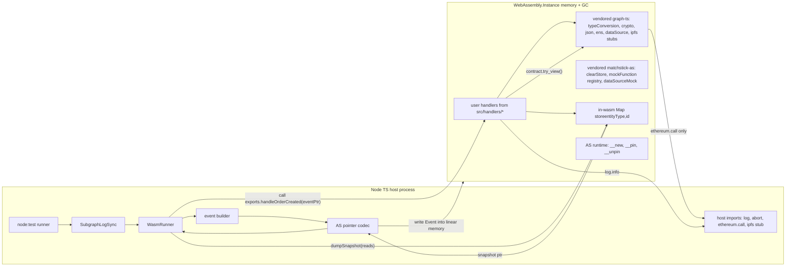

# Native WASM Runner — Implementation Plan

## Goal

Drop the `spawn("graph", ["test", ...])` cycle from [packages/matchstick-ts/src/snapshot.ts](packages/matchstick-ts/src/snapshot.ts) and replace it with an in-process Node runtime that:

- Compiles the subgraph wasm **once** per test file (via stock `asc` or by reusing matchstick's compile cache).
- Holds **one** `WebAssembly.Instance` warm across test cases. Reset = `store.clear()` on a wasm-side map, not a process restart.
- Implements host functions directly in TS where they must live on the JS side; pushes everything else into AS via a vendored graph-ts shim so it inlines and runs at full V8-wasm speed.

Target: per-test cost from ~150–300 ms (current `graph test` boot + JSON IO) down to ~1–5 ms (single wasm call + JS-side store dump).

## Architecture



## Package layout

New packages under [packages/](packages/):

- `packages/graph-ts-vendored/` — fork of `@graphprotocol/graph-ts` with the host-declared namespaces rewritten as real AS impls. Same public API; the indexer's test build resolves `@graphprotocol/graph-ts` here via tsconfig paths.
- `packages/matchstick-as-vendored/` — fork of `matchstick-as/assembly/*` with `clearStore`, `mockFunction`, `dataSourceMock`, `countEntities` rewritten as pure AS over an in-wasm store + mock registry.
- `packages/wasm-runner/` — TS package. The `graph test` replacement. Loads the wasm, exposes `WasmRunner.replay(events, mocks) -> Snapshot`.

[packages/matchstick-ts/src/snapshot.ts](packages/matchstick-ts/src/snapshot.ts) and [packages/matchstick-ts/src/log-sync.ts](packages/matchstick-ts/src/log-sync.ts) get a new code path that uses `WasmRunner` instead of `spawn("graph", ...)`. Existing matchstick path stays as fallback under a `runner: "matchstick" | "native"` option until parity is proven, then is removed.

## Host surface after vendoring

Lives in **AS** (no JS boundary):

| Module           | Functions                                                                                                                                                                           |
| ---------------- | ----------------------------------------------------------------------------------------------------------------------------------------------------------------------------------- |
| `typeConversion` | bytesToString, bytesToHex, bigIntToString, bigIntToHex, stringToH160, bytesToBase58                                                                                                 |
| `crypto`         | keccak256 (pure-AS impl; see Phase 2 about optionally moving back to host for speed)                                                                                                |
| `json`           | toI64, toU64, toF64, toBigInt; fromBytes/try_fromBytes only if a handler needs them (yours don't)                                                                                   |
| `ens`            | nameByHash → null                                                                                                                                                                   |
| `dataSource`     | address, network, context, create, createWithContext (backed by AS globals; JS sets them via exported `__setDataSourceContext(addr, network, contextPtr)` before each handler call) |
| `ipfs`           | cat, map → null/no-op stubs                                                                                                                                                         |
| `matchstick-as`  | clearStore, countEntities, mockFunction, dataSourceMock, mockInBlockStore                                                                                                           |
| `_register*`     | no-ops (we don't use matchstick's test registration; we call handler exports directly)                                                                                              |

Lives in **TS** (host imports):

| Import                                                | Why                                                                            |
| ----------------------------------------------------- | ------------------------------------------------------------------------------ |
| `env.abort(msgPtr, filePtr, line, col)`               | translate to JS Error with file/line                                           |
| `env.seed()`                                          | deterministic constant for tests                                               |
| `index.log.log(level, msgPtr)`                        | pipe to console/pino                                                           |
| `index.ethereum.call(callPtr) -> arrPtr \| null`      | dispatch against the AS-side mock registry — needs reads of dynamic mock state |
| `index.bigInt.*` (12 fns)                             | use JS native `bigint`; faster than software bignum in AS                      |
| `index.store.get/set/remove/loadRelated/get_in_block` | backed by a JS `Map<entityType, Map<id, ptr>>` — see "Store design" below      |

That's ~20 host imports vs. ~50+ in the naive variant.

## Store design choice

Two viable variants — pick one explicitly:

- **Variant A — store in JS, entities as pinned ptrs.** `store.set(typePtr, idPtr, entityPtr)` calls `__pin(entityPtr)` and stores `{ type, id, ptr }` in a JS `Map`. `store.get` returns the pinned ptr. JS owns the map, easy snapshot dump and easy reset. Cost: one boundary cross per `store.get/set` (cheap — just three i32 args, no payload marshalling).
- **Variant B — store in AS, dump-only boundary.** `store` is a vendored matchstick-as namespace backed by a pure-AS `Map<string, Map<string, Entity>>`. JS never touches the store during replay. At snapshot time JS calls an exported `__dumpSnapshot(readsJsonPtr) -> jsonStringPtr` and parses the JSON. Cost: snapshot dump materializes to JSON in-wasm (acceptable — happens once per `index()` call, not per event).

Recommendation: **Variant B**, because (1) zero boundary crossings during handler execution, (2) the snapshot-dump path is already proven by the current AS runner in [packages/matchstick-ts/src/codegen/generate-runner.ts](packages/matchstick-ts/src/codegen/generate-runner.ts) (it builds JSON in-wasm with `JSONObjectBuilder`), so the code is mostly reusable.

## Event ingestion path

Replaces the JSON-file IO completely. Today:

1. TS writes `tests/.tmp/events.json` (see [DEFAULT_TMP_DIR in snapshot.ts](packages/matchstick-ts/src/snapshot.ts))
2. AS runner calls `readFile("tests/.tmp/events.json")`, `json.fromBytes`, iterates, builds `ethereum.Event` via `createMockEvent`

New:

1. TS event builder takes a `CapturedEvent` (already defined in [event-capture.ts](packages/matchstick-ts/src/event-capture.ts)) plus its event-type ABI param schema, and writes an AS `ethereum.Event` directly into wasm memory via the pointer codec.
2. JS calls `exports.<handlerName>(eventPtr)` directly — no string-keyed router.
3. After all events replayed, JS calls `exports.__dumpSnapshot(...)` and parses the returned JSON string.

The event builder needs access to:

- The event's ordered parameter types (decoded from the subgraph manifest + ABI) — already parsed in [packages/matchstick-ts/src/codegen/parse-subgraph-manifest.ts](packages/matchstick-ts/src/codegen/parse-subgraph-manifest.ts) and similar locations in the codegen module.
- A handler-name lookup (event name → exported handler symbol) — also already produced by [generate-runner.ts](packages/matchstick-ts/src/codegen/generate-runner.ts) lines 67-83 (the `routes` array).

So existing codegen is the source of metadata; the wasm-runner consumes it at runtime instead of emitting AS code.

## Pointer codec — what we have to write in TS

A single module `packages/wasm-runner/src/codec.ts`. APIs:

```
readString(ptr) / writeString(s)         // AS UTF-16 string layout
readBytes(ptr) / writeBytes(buf)         // AS Uint8Array / Bytes
readBigInt(ptr) / writeBigInt(value)     // AS BigInt = signed LE bytes
readEntity(ptr) / writeEntity(record)    // AS Entity = TypedMap<string, Value>
readEthValue(ptr) / writeEthValue(value) // 10-variant tagged union
readEthEvent / writeEthEvent             // ethereum.Event (sugar over Value array + Block + Transaction)
__new(size, classId) / __pin / __unpin   // wasm exports — thin wrappers
```

Class IDs come from the wasm's `__rttiBase` table — parsed once at instantiation by [packages/wasm-runner/src/rtti.ts](packages/wasm-runner/src/rtti.ts). This avoids hardcoding IDs that change between AS compiler versions.

## Phasing

### Phase 0 — spike (1–2 days)

Goal: prove an end-to-end happy path with **one** event, **one** handler, **zero** ABI-decode complexity, against the real futures-marketplace wasm.

- Compile the futures-marketplace indexer wasm via `asc` (or pull the `.wasm` matchstick generates in `tests/.bin/<runner>.wasm` to skip compile work in the spike).
- Implement only: `env.abort`, `env.seed`, `index.log.log`, and the absolute-minimum subset of host imports the chosen handler actually pulls in (probably just `typeConversion.bytesToHex`, `typeConversion.stringToH160`, `store.get`, `store.set` for `handleOrderCreated`).
- Pointer codec: `readString`, `writeString`, `readBytes`, `writeBytes`, `writeEthValue` for `Address` + `BigInt` + `Bytes` + `Uint` only.
- Instantiate, fire a single `OrderCreated` event, dump the resulting `Order` entity from the JS-side store.
- Benchmark: 100 events through the same instance vs. 100 events through `graph test`.

Exit criterion: a passing `node --test` file in [packages/wasm-runner/tests/spike.test.ts](packages/wasm-runner/tests/spike.test.ts) that asserts on an `Order` field. **Stop here and check numbers before continuing.**

### Phase 1 — vendor graph-ts and matchstick-as (3–5 days)

- Copy `@graphprotocol/graph-ts` into `packages/graph-ts-vendored/`. Keep `index.ts`, `common/*`, `chain/ethereum.ts`, `types/*`, `helper-functions.ts` byte-identical to upstream. Rewrite only the `declare namespace` blocks:
  - `common/conversion.ts`: tier-2 typeConversion as AS bodies.
  - `common/json.ts`: `json.toI64/U64/F64/BigInt` as AS; `fromBytes`/`try_fromBytes` left as `declare` (host) — they're rare and the AS JSON parser cost isn't worth it yet.
  - `index.ts`: `crypto.keccak256` as pure AS (port `as-bignum` keccak or implement directly).
  - `index.ts`: `ens.nameByHash` returns null.
  - `index.ts`: `ipfs.cat/map` left as `declare` (host) — stubs in TS.
  - `common/datasource.ts`: `dataSource.*` reads from AS module globals set via an exported `__setDataSourceContext`.
  - `common/numbers.ts`: `bigInt.*` and `bigDecimal.*` left as `declare` (host) — keep on JS for `bigint` perf.
- Copy `matchstick-as/assembly` into `packages/matchstick-as-vendored/`. Rewrite:
  - `store.ts`: backed by an AS-side `Map<string, Map<string, Entity>>`.
  - `data_source_mock.ts`: setters write into the `dataSource` globals from vendored graph-ts.
  - `index.ts`: `mockFunction` records into an AS-side `Map<key, MockedCall>`; key is `address|signature|argsHash`. `_registerTest` etc. become no-ops.
  - Add an exported `__dumpSnapshot(readsJsonPtr) -> jsonStringPtr` that walks the store and produces the same JSON shape the existing runner does (preserve `MANIFEST:` / `SNAPSHOT:` shape so existing snapshot parsing in [snapshot.ts](packages/matchstick-ts/src/snapshot.ts) line 444-465 keeps working).
- Indexer tsconfig (for test builds only): add a `paths` override mapping `@graphprotocol/graph-ts` → `packages/graph-ts-vendored/index.ts` and `matchstick-as/assembly` → `packages/matchstick-as-vendored/index.ts`. Production builds (`pnpm graph build`) leave the paths unset.

### Phase 2 — wasm-runner core (5–7 days)

- `packages/wasm-runner/src/codec.ts` — full pointer codec for `Address`, `BigInt`, `Bytes`, `String`, `Entity`, `Value`, `Event`, `Block`, `Transaction`. Drive class IDs from the `__rttiBase` table parser in `rtti.ts`.
- `packages/wasm-runner/src/host.ts` — implementation of the host imports list above. The non-trivial entries:
  - `index.bigInt.*` — read AS BigInt bytes (signed LE), convert to JS `bigint`, do the op, encode back. ~120 lines.
  - `index.ethereum.call` — read `SmartContractCall` (5 fields), look up the mock by `(address.toLowerCase, signature, argsHash)`, return marshalled `Value[]` ptr or `null`. ~250 lines including `Value` encoder coverage.
  - `index.store.*` — Variant B: thin proxies that forward to the AS-side store via exported helpers. But the imports are still required because graph-ts uses `declare namespace store` and the indexer's generated code calls them; vendored graph-ts forwards them to vendored matchstick-as's store. So in Variant B these may not even be host imports — they become AS calls. **TBD during Phase 2 implementation depending on how cleanly graph-ts's `store` can be vendored to skip the host.**
- `packages/wasm-runner/src/event-builder.ts` — synthesize `ethereum.Event` from a `CapturedEvent` plus an ABI param schema. Reuse the manifest parser already in [packages/matchstick-ts/src/codegen/parse-subgraph-manifest.ts](packages/matchstick-ts/src/codegen/parse-subgraph-manifest.ts) for handler routing metadata.
- `packages/wasm-runner/src/runner.ts` — `WasmRunner` class with `compile(wasmPath)`, `replay({events, mocks, reads}) -> RawSnapshot`. Holds one `WebAssembly.Module` (compile once), creates one `WebAssembly.Instance` per `replay()` call (cheap — ~1 ms), or reuses an instance via wasm-side `clearStore` (TBD which is faster; measure).

### Phase 3 — wire into matchstick-ts (2–3 days)

- Add `runner: "matchstick" | "native"` to [RunOptions in snapshot.ts](packages/matchstick-ts/src/snapshot.ts). Default `"matchstick"` initially, flip to `"native"` once parity proves out.
- `native` branch in `runMatchstickTest` skips `spawn`, file IO, and the schema patch entirely. Calls `WasmRunner.replay(...)` and returns a `Snapshot` from the result.
- [SubgraphLogSync](packages/matchstick-ts/src/log-sync.ts) is unchanged — it just calls `runMatchstickTest` which now has the fast path.

### Phase 4 — conformance + cleanup (2–3 days)

- `packages/graph-ts-vendored/tests/conformance.test.ts` — fixed input/output vectors for every vendored function. Cross-check against graph-node's [host_exports test vectors](https://github.com/graphprotocol/graph-node/blob/master/runtime/wasm/src/host_exports.rs) where they exist; for the rest, generate ground truth by running the same input through the unvendored graph-ts via `graph test`.
- Benchmark: a representative futures-marketplace integration test (e.g. [indexer/integration/lot-exits.test.ts](indexer/integration/lot-exits.test.ts)) under both runners. Expect 10–50× per-test speedup.
- Once parity confirmed: delete the matchstick spawn path from `snapshot.ts`, drop `@graphprotocol/graph-cli` and `matchstick-as` from runtime deps (still needed for production `graph build`, but moved to devDependencies of the indexer, not matchstick-ts).

## What stays as today

- [packages/matchstick-ts/src/event-capture.ts](packages/matchstick-ts/src/event-capture.ts) — `CapturedEvent` shape and receipt parsing are unchanged; the new runner consumes the same type.
- [packages/matchstick-ts/src/codegen/parse-subgraph-manifest.ts](packages/matchstick-ts/src/codegen/parse-subgraph-manifest.ts) and [generate-entities.ts](packages/matchstick-ts/src/codegen/generate-entities.ts) — still needed for the typed `entities.d.ts` augmentation. Only `generate-runner.ts` becomes optional (kept behind `runner: "matchstick"` for fallback).
- [packages/matchstick-ts/src/harness.ts](packages/matchstick-ts/src/harness.ts) and [log-sync.ts](packages/matchstick-ts/src/log-sync.ts) public APIs — unchanged. Consumer tests in `indexer/integration/*.test.ts` keep working without modification.
- Production `graph build` / `graph deploy` — completely untouched. Vendoring only applies to the test runtime via tsconfig path overrides.

## Risk register

- **Drift between vendored graph-ts and graph-node host impls.** Bounded by conformance vectors (Phase 4). Anything that fails conformance gets pushed back to host imports.
- **AS RTTI changes across `asc` versions.** Parse `__rttiBase` at runtime rather than hardcoding class IDs; pin `assemblyscript` version in the indexer.
- **`ethereum.call` mock semantics.** matchstick is permissive about arg-matching; we should match its key-builder exactly (address lowercased, signature canonicalized, args ABI-encoded then hashed). Easy to get subtly wrong; covered by a dedicated test suite mirroring matchstick's mock tests.
- **Snapshot dump format divergence.** The current AS runner emits a specific JSON shape ([generate-runner.ts](packages/matchstick-ts/src/codegen/generate-runner.ts) line 240-247). Vendored `__dumpSnapshot` must emit identical shape so the parser in [snapshot.ts](packages/matchstick-ts/src/snapshot.ts) doesn't change.
- **Source maps / error reporting.** `env.abort` from AS will report wasm-internal file/line. Need to translate via the AS source map emitted at compile time, otherwise debugging handler bugs gets worse than matchstick. Implementation: load `*.wasm.map` if present, translate `abort` args.
